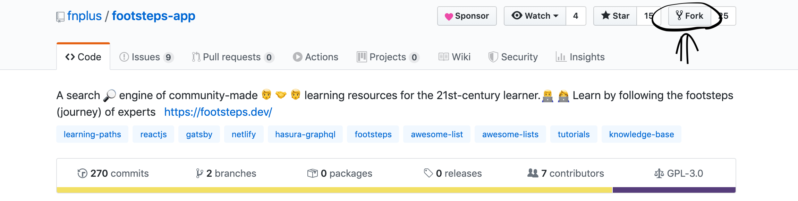
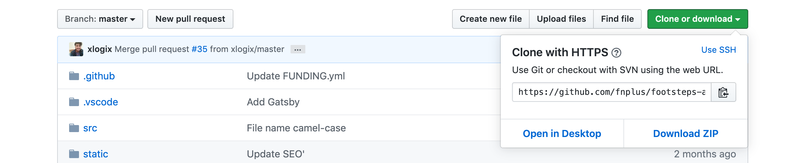
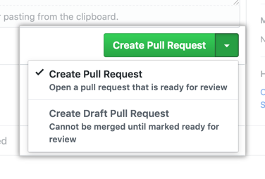
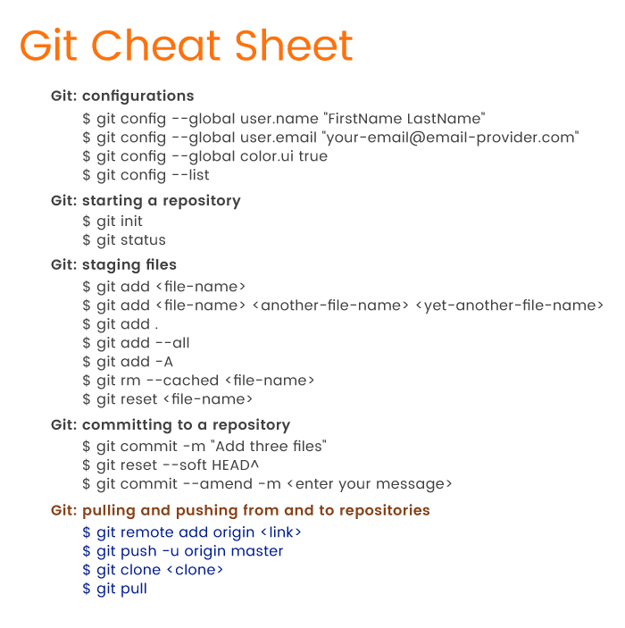

# Guidelines

## Contributing to 👣 Fnplus Open Source Projects
Fnplus welcomes contributions to open source projects on Github. When contributing, please follow the [Code of Conduct](/CODE_OF_CONDUCT.md).
## Issues
Feel free to submit issues and enhancement requests. All requests would be entertained with respect to CODE OF CONDUCT. We welcome your ideas and creativity.
## Contributing
### Setting Up GitHub And Git For The First Time
#### Get a github account
#### Download and install git
#### Check by typing git version in the terminal
#### Set up git with your user name and email
## Open a terminal/shell and type
```bash
git config --global user.name "Your name here"
```
```bash
git config --global user.email "your_email@example.com"
```
(Don’t type the $; that just indicates that you’re doing this at the command line.)
For any technical issues while setting up visit this page by Github —  
[Getting Started With Github](https://help.github.com/en/github/getting-started-with-github)
## 1. Fork the project
Click on the FORK icon on top right of your screen .

## 2. Clone the Project
After the step 1, you have to click on the Green Colored “Clone or download” button and copy the web-URL .

## 3. Open GitBash Software
Open Terminal/Command Line and write the command
```bash
git clone <link you copied> e.g
```
```bash
git clone https://github.com/YOUR-USERNAME/ProjectName
```
Press Enter. Your local clone will be created.
Then, go to footsteps-app (cd footsteps-app) and do ``` git remote add upstream https://github.com/fnplus/footsteps-app.git ``` (use git@github.com:fnplus/footsteps-app.git if using SSH) to add a remote called upstream and link it to Footsteps's main repository (this will be used to merge with the latest version on develop and also to prevent running lint checks on merge commits when you later update your local branch with upstream/master).
If your upstream is not set correctly, the lint checks will run on merge commits as well. The way to fix this will be to update the upstream URL by running the following command: ```git remote set-url upstream https://github.com/fnplus/footsteps-app.git ``` (use git@github.com:fnplus/footsteps-app.git if using SSH)

## 4. Update your local repository and create your separate Branch
To create a separate branch write this command on Github —

```bash
git fetch upstream
git checkout develop
git merge upstream/develop
git checkout -b your-branch-name 
```

This will update your local repo with latest changes and also create a new branch with name as your-branch-name. 
If you find any difficulty, please check [Fork a repo-Github Help](https://help.github.com/en/github/getting-started-with-github/fork-a-repo)

### Tip: Always work on a new branch and don’t mess up the master branch
## 5. Open the project
Now, Open the project in your local device. It will be in the directory where you cloned the project.
After opening the project, make some meaningful changes to the project(Add features, Modify existing code, Add files/Readme.md) .
## 6. Add your changes
To add all the changes you made write the command
```bash
git add .
```
## 7. Commit Changes
Commit all your changes using the command
```bash
git commit -m "commit message"
```
## 9. Push Your Code
```bash
git push -u origin <name_of_your_new_branch>
```
## 10. Pull Request
To create a pull request that is ready for review, click Create Pull Request. For more information about creating pull requests, see “About pull requests.”
### 
### 
### 👍 Hurrah! You are all set to contribute to the Open Source Community

## ⚡️⚡️⚡️⚡️ Enjoy Contributing 
